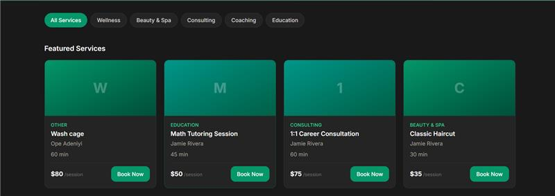
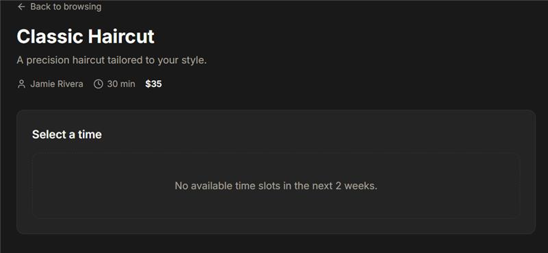

# Slotify

> A real-time service booking platform with live slot availability, secure Stripe payments, and zero double-bookings.

## The Problem

Small service businesses (tutors, salons, consultants) need a booking system that handles the messy reality of scheduling: two customers racing for the same slot, payments failing mid-checkout, and providers needing a simple way to manage their availability — without the overhead of enterprise booking software.

Slotify solves this with real-time slot locking, so once a customer starts checkout, that slot is held for them and instantly hidden from everyone else — no double-bookings, no awkward "sorry, that time's actually taken" emails.

## Live Demo

🔗 [slotify-nu.vercel.app](#)

## Screenshots

*(Design screens generated via Stitch — added once available)*

| Service Listing | Slot Picker | Checkout |
|---|---|---|
|  |  |  |

## Tech Stack

**Frontend**
- Next.js (React + TypeScript)
- Tailwind CSS
- Zustand — client state management

**Backend**
- Next.js API routes
- PostgreSQL + Prisma ORM — persistent data (users, bookings, services)
- Redis — slot holds with TTL-based auto-expiry
- Socket.io — real-time slot status updates across clients

**Payments & Auth**
- Stripe (test mode) — checkout and payment confirmation
- NextAuth.js — email + Google OAuth, guest checkout supported

**Testing & Quality**
- Vitest + React Testing Library — unit/integration tests
- Playwright — end-to-end tests
- Lighthouse + axe — performance and accessibility audits

**Deployment**
- Vercel — hosting
- GitHub Actions — CI/CD pipeline

## Project Case Study

This project was built following a full software development lifecycle, documented in `/docs`:

- [`01-idea.md`](docs/01-idea.md) — Problem definition and target users
- [`02-requirements.md`](docs/02-requirements.md) — Mini-PRD, user stories, acceptance criteria
- [`03-design.md`](docs/03-design.md) — System architecture, slot-locking mechanism, UX decisions

## Key Technical Challenge: Slot Locking

The hardest part of this build: preventing two customers from booking the same time slot. Slotify uses Redis TTL keys to hold a slot for 5 minutes during checkout, with Postgres transactions guaranteeing consistency on final booking confirmation. Full breakdown and race-condition handling in [`03-design.md`](docs/03-design.md).

## Local Setup

### Prerequisites
- Node.js 18+
- PostgreSQL (local or hosted, e.g. Supabase/Neon)
- Redis (local or hosted, e.g. Upstash)
- A Stripe account (test mode keys)

### Installation

```bash
git clone https://github.com/dev-ransom/slotify.git
cd slotify
npm install
```

### Environment Variables

Copy `.env.example` to `.env.local` and fill in your own values:

```bash
cp .env.example .env.local
```

```
DATABASE_URL=
REDIS_URL=
STRIPE_SECRET_KEY=
STRIPE_PUBLISHABLE_KEY=
NEXTAUTH_SECRET=
NEXT_PUBLIC_GA_MEASUREMENT_ID=
```

### Run the app

```bash
npx prisma migrate dev
npm run dev
```

Visit `http://localhost:3000`

### Run tests

```bash
npm run test          # unit/integration
npm run test:e2e      # Playwright end-to-end
```

## Roadmap

See [`CHANGELOG.md`](CHANGELOG.md) for what's shipped and what's next. Known scope cuts for MVP: multi-provider marketplace, recurring bookings, SMS reminders.

## License

MIT
